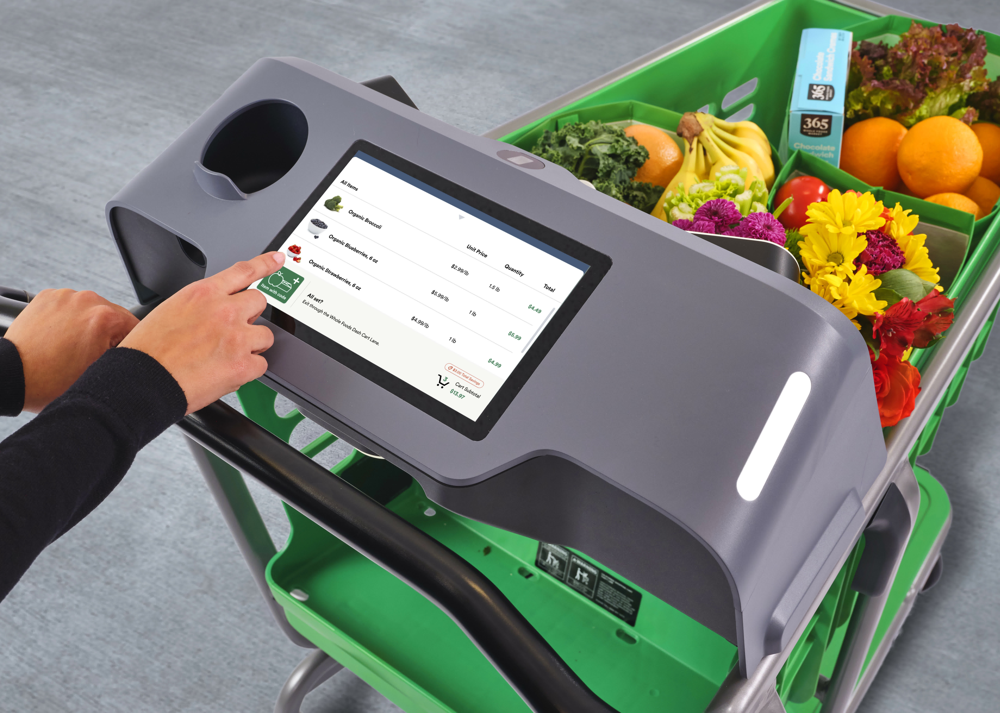
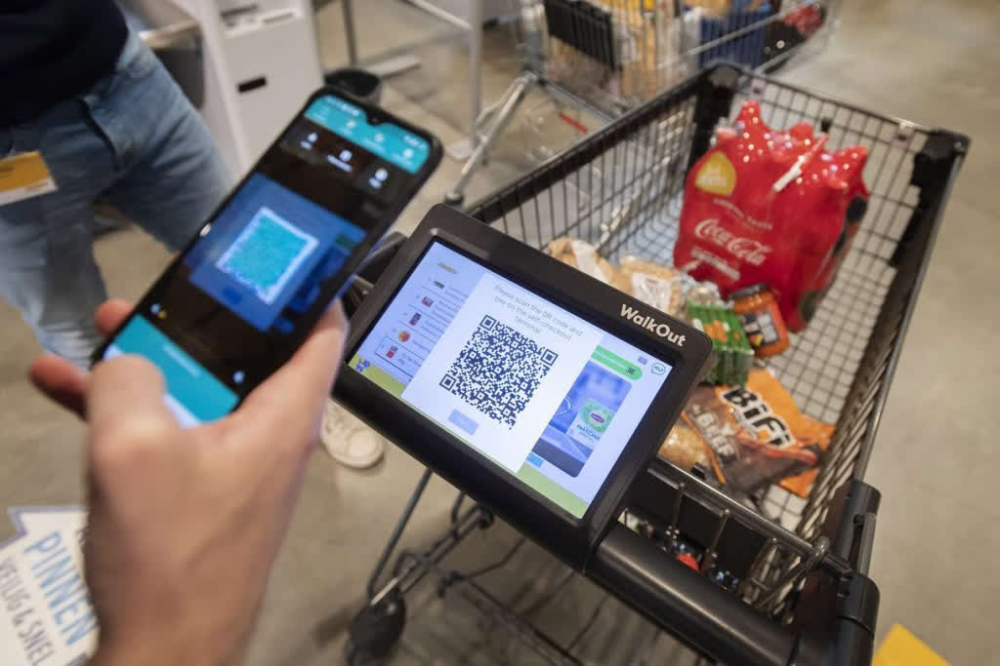
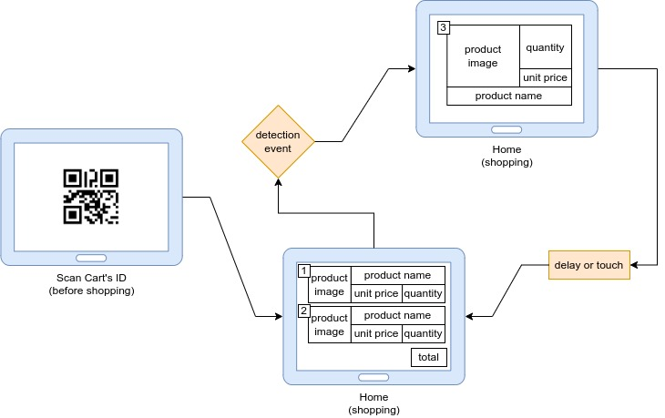
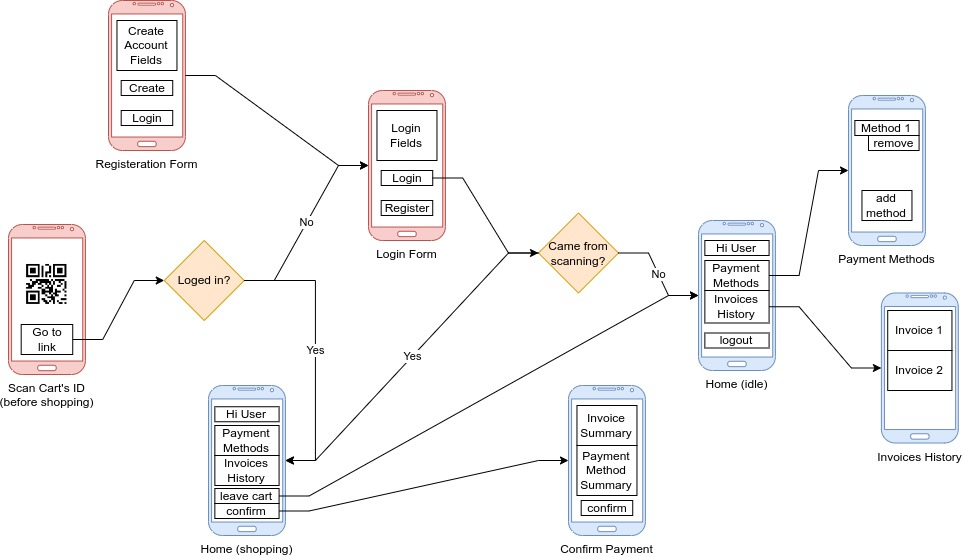

# Smart Cart

###### *Smart cart which provides the best shopping experience*

Customers need no cash money, no cashiers, nor printed invoices.
They just scan the QR code in cart's screen with their phone, pick their needs, 
and go, all automated via online payment!
That can significantly decrease labor cost in the long run 
and eliminates queues in rush hours.

The cart detects what a customer puts in or removes from the basket.
It displays what products are picked, their prices and total.
It also displays QR code to confirm payment from the phone's browser.

<!-------------------------------------------------------------------->

<!-------------------------------------------------------------------->
<!-------------------------------------------------------------------->
## Overall Description
### Product Perspective
The product has two core features, objects detection model, 
and main application. The project is divided into two sections, two teams, 
a team for each feature of them.

In this repository, we are concerned with the second, the main application. 
It is a web application which has two user interfaces, Cart interface and  
customer's phone interface.

<!-------------------------------------------------------------------->
### Product Features
- Automatic detection of products in cart's basket
- Display product details, quantities, prices, and total price
- Display QR code to confirm payment from web browser in customer's phone
- Send digital invoice to customer's account
- Create account for customer's to save payment method and previous invoices

<!-------------------------------------------------------------------->
### User Classes and Characteristics
The cart is made for single user, 
a customer who is in the market, has a payment method, and a smart phone.

<!-------------------------------------------------------------------->
<!-------------------------------------------------------------------->
## Specific Requirements
### External Interface Requirements
#### User Interfaces
We have two user interfaces, Cart UI, and customer's phone UI.

##### User Interface of Cart
A web interface which is accessible in cart's touch screen.
It displays the detected products, displays a QR code for payment, 
and sends invoices.

##### User Interface of Customer's Phone
A web interface which is accessible in customer's web browser.
It has registration System, save invoices, and does payments.

<!-- #### Hardware Interfaces -->
<!---->
<!-- #### Software Interfaces -->
<!---->
<!-- #### External Data Interfaces -->
<!---->
<!-- #### Components of Cart Controller -->
<!---->
<!-- | # | Item             | Description                                           | Required in  |  -->
<!-- | - |:---------------- |:----------------------------------------------------- | ------------ | -->
<!-- | 1 | Raspberry Pi     | Main microcontroler and includes Wi-Fi                | Development  | -->
<!-- | 2 | Camera           | Detects produts inside the cart's basket              | Development  | -->
<!-- | 3 | LCD Touch Screen | Displays products details and QR code of payment link | Production   | -->
<!-- | 4 | HDMI Cable       | Connects touch screen with Raspberry Pi               | Production   | -->
<!-- | 5 | White torch(es)  | Light the basket for the camera                       | Production   | -->
<!-- | 6 | Power Bank       | Provides power for all components                     | Production   | -->
<!---->
<!-- ### Functional Requirements -->
<!---->
<!-- ### Non-Functional Requirements -->
<!---->
<!-- ### System Design -->
<!---->
<!-- ### Organizational Requirements -->
